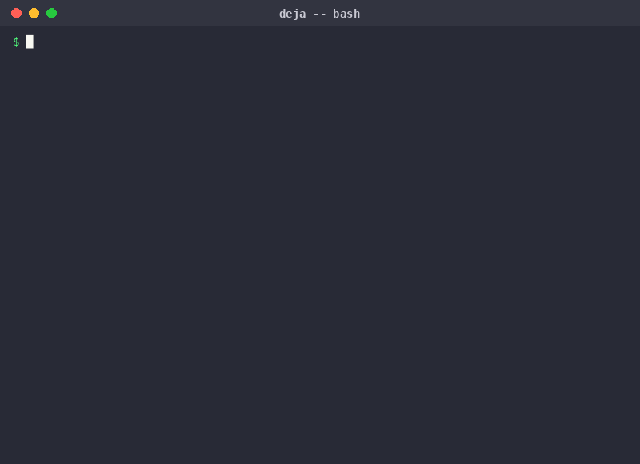

# Deja

[](https://github.com/kasparovabi/deja/actions/workflows/ci.yml)
[](https://python.org)
[](LICENSE)
[](#technical-details)

**The invisible automation layer for Claude Code.**

<p align="center">
  
</p>

Deja is an open source Claude Code hook that runs silently in the background while you work. It watches every action you take across sessions, discovers repeated patterns in your workflow, and tells you about them so you can automate the boring parts.

You don't configure anything. You don't change how you work. You just install it once and forget about it. Deja does the rest.

## The Problem

Every developer has habits they don't notice. You grep for something, open the file, edit it, run the tests, then fix the lint errors. You do this ten times a day without thinking about it. Multiply that across weeks and you're spending hours on sequences that could be a single command.

The issue is that nobody sits down and audits their own workflow. It's tedious, it's invisible, and honestly most people don't even realize they're repeating themselves.

## What Deja Does

Deja hooks into Claude Code's event system and records every tool action: file reads, edits, searches, bash commands, everything. It stores these as session traces. When a session ends, Deja runs a pattern detection algorithm across all your recorded sessions. It looks for contiguous subsequences of tool usage that appear in two or more sessions.

When you start a new session, Deja loads the patterns it found and injects them into Claude's context. Claude now knows "hey, this user frequently does Grep then Read then Edit then Bash then Bash" and can proactively suggest or execute that workflow.

### How the Detection Works

1. Every `PostToolUse` event is recorded as an `Action` with the tool name, a short input summary, timestamp, and session ID
2. Actions within a session form a `SessionTrace`, which is essentially an ordered list of tool names
3. The detector extracts all contiguous subsequences of length 3 to 15 from each session
4. It counts how many *distinct* sessions each subsequence appears in
5. Subsequences that appear in 2+ sessions become candidate patterns
6. Strict subsets of longer patterns are removed (if "A B C" is always part of "A B C D", only the longer one survives)
7. Results are sorted by frequency first, then by length

No machine learning, no cloud calls, no external dependencies. Pure algorithmic analysis using Python's standard library.

### What Gets Stored

All data lives in a `.deja/` directory (local or global depending on your install):

```
.deja/
    traces/
        2026-04-01_session123.jsonl    # one JSONL file per session
        2026-04-02_session456.jsonl
    patterns.json                       # discovered workflow patterns
```

Each line in a trace file is a JSON object:

```json
{"tool": "Grep", "input_summary": "grep:TODO", "timestamp": "2026-04-01T14:30:00+00:00", "session_id": "abc123", "success": true}
{"tool": "Read", "input_summary": "/src/main.py", "timestamp": "2026-04-01T14:30:05+00:00", "session_id": "abc123", "success": true}
{"tool": "Edit", "input_summary": "edit:/src/main.py", "timestamp": "2026-04-01T14:30:15+00:00", "session_id": "abc123", "success": true}
```

Nothing sensitive is stored. Input summaries are truncated to 200 characters and only contain file paths or command previews, never file contents.

## Installation

### Quick Install (Recommended)

```bash
pip install deja-code && deja setup
```

That's it. Two commands, zero configuration. Deja installs globally and works in every project.

### Install from Claude Code

Already inside a Claude Code session? Just ask Claude:

> Install deja for me: `pip install deja-code && deja setup`

Claude will run it and Deja starts working immediately — in that session and every future one.

### Install from GitHub (latest development version)

```bash
pip install git+https://github.com/kasparovabi/deja.git#egg=deja-code && deja setup
```

### Per-Project Install

If you only want Deja active in a specific project:

```bash
pip install deja-code
cd your-project
deja install
```

This writes to `your-project/.claude/settings.json` and creates `your-project/.deja/`.

### Windows

Deja automatically detects Windows and uses the correct Python path in hook commands. No manual configuration needed.

### Uninstalling

```bash
deja uninstall --global    # remove global hooks
deja uninstall             # remove project hooks
deja clear                 # delete all recorded data
pip uninstall deja-code    # remove the package
```

## Usage

There is no usage. That's the point.

Install it and use Claude Code exactly as you always do. Deja is completely invisible during your sessions. It only surfaces information when:

1. A session **ends** and new patterns are found (logged silently)
2. A session **starts** and previously discovered patterns exist (injected as context for Claude)

### CLI Commands

To inspect what Deja has learned:

```bash
deja status      # installation status, session count, pattern count
deja patterns    # list all discovered workflow patterns with details
deja traces      # show recorded sessions and their tool sequences
deja analyse     # force pattern analysis right now (normally happens on session end)
deja clear       # wipe all traces and patterns
```

### Example Output

After a few sessions, `deja patterns` might show:

```
Discovered 3 workflow pattern(s):

  Pattern 1: Grep > Read > Edit > Bash > Bash
    Steps:    Grep -> Read -> Edit -> Bash -> Bash
    Seen in:  4 sessions
    Example:
      1. [Grep] grep:handleSubmit
      2. [Read] /src/components/Form.tsx
      3. [Edit] edit:/src/components/Form.tsx
      4. [Bash] npm test
      5. [Bash] npm run lint

  Pattern 2: Read > Edit > Read > Edit
    Steps:    Read -> Edit -> Read -> Edit
    Seen in:  3 sessions

  Pattern 3: Glob > Read > Edit > Bash
    Steps:    Glob -> Read -> Edit -> Bash
    Seen in:  2 sessions
```

## Architecture

```
deja/
    __init__.py         # package metadata (version 0.1.0)
    __main__.py         # entry point: deja
    cli.py              # 7 CLI commands (install, uninstall, patterns, traces, status, analyse, clear)
    recorder.py         # Action/SessionTrace dataclasses, JSONL storage, summarise_input()
    detector.py         # Pattern detection: subsequence extraction, frequency counting, subset pruning
    hooks.py            # Claude Code hook handlers (PostToolUse, Stop, SessionStart)
    installer.py        # Hook registration into .claude/settings.json (local + global)
```

### Hook Integration

Deja registers three hooks in Claude Code's settings:

| Event | What Deja Does | Timeout |
|-------|---------------|---------|
| `PostToolUse` | Records the action to the session's JSONL trace file | 5s |
| `Stop` | Loads all traces, runs pattern detection, saves new patterns | 15s |
| `SessionStart` | Loads saved patterns and injects them as context for Claude | 5s |

Hooks communicate via stdin/stdout JSON, following Claude Code's hook protocol. Exit code 0 means success (parse the JSON output), exit code 2 means blocking error.

## Technical Details

**Python Version**: 3.10+

**External Dependencies**: None. Everything uses Python's standard library (json, pathlib, dataclasses, argparse, datetime, shutil).

**Test Suite**: 48 tests covering all Deja functionality. Run with:

```bash
python -m pytest tests/ -v
```

**Data Safety**: Deja never modifies your code, never sends data anywhere, and never interferes with Claude Code's normal operation. It only *reads* hook events and *writes* to its own `.deja/` directory.

## Roadmap

This project is part of a larger vision for AI coding tool infrastructure:

**Deja v2**: Workflow replay (not just detection, but execution), cross project pattern aggregation, pattern sharing between team members

**AgentBlackBox**: SaaS audit trail for AI agent sessions. Full token cost tracking, decision tree visualization, compliance reporting for enterprises that need to prove what their AI agents did and why.

**MirrorMode**: Cross agent workflow translation. Record a workflow in Claude Code, replay it in Cursor or Aider. Universal session format that works across all AI coding tools.

## Contributing

This project is in active development. If you're interested in contributing, the codebase is intentionally simple and well tested. Every module is under 200 lines and uses no external dependencies.

## License

MIT
